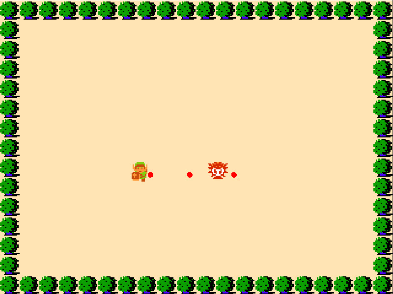

<h1 align="center"> Game Study </h1>

  App desenvolvido durante estudo de desenvolvimento de Games   

  <a href="#-tecnologias">Tecnologia</a>&nbsp;&nbsp;|&nbsp;&nbsp;
  <a href="#-projeto">Projeto</a>

 

  

## 👨🏻‍💻 Tecnologias

Tecnologias utilizadas:

- Java
- Eclipse
- Git e Github

## 💻 Projeto

App com o objetivo de testar tecnologias e metôdos para criação de jogos
